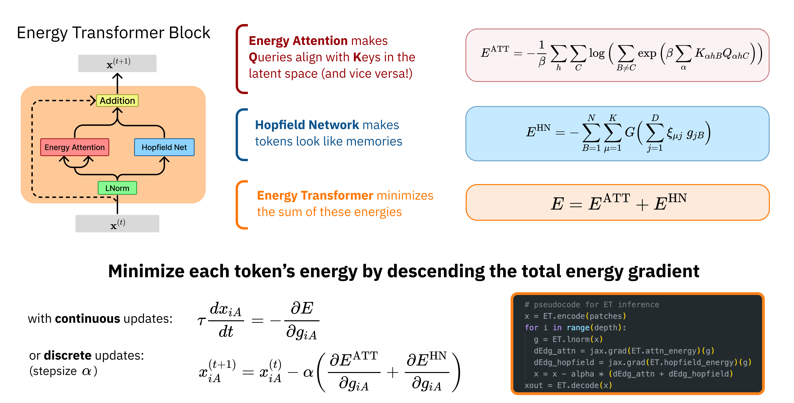

# Energy Transformer
> A novel Transformer variant that is both an associative memory model and a continuous dynamical system with a tractable energy that is guaranteed to converge to a fixed point. See [our paper](https://arxiv.org/abs/2302.07253) for full details. Also, check out other official implementations of our work, see [ET for Graph Anamoly Detection (PyTorch)](https://github.com/zhuergou/Energy-Transformer-for-Graph-Anomaly-Detection/), [ET for Graph Classification (Jax)](https://github.com/Lemon-cmd/energy-transformer-graph) and [ET for Image (Jax)](https://github.com/bhoov/energy-transformer-jax).


This is the official repository for the Energy Transformer (ET) written in PyTorch. The aim of this repository is to provide a quick example of ET usage in mask image completion and for users who are familiar with PyTorch and are interested in utilizing ET, which is originally written and developed in Jax.

# Installation
**Update (3/9/2023)**: Code is updated to user Accelerator from Huggingface and PyTorch 2.1.2.
```
pip install -r requirements.txt
```
If you encounter trouble with installing PyTorch, see https://pytorch.org for further instructions and [huggingface](https://huggingface.co/docs/accelerate/en/index) for accelerator tips. Credits to [Ben Hoover](https://github.com/bhoov) for the diagrams.

<p float="center">

</p>

# Model
<p float="center">
    
    
    
    
    
    
    
    
    
    
    
    
</p>

```python
from image_et import ImageET as ET

x = torch.randn(1, 3, 32, 32)                        # create an input for initialization

patch_fn = Patch(dim=4)                              # create Patcher and provide patch size

model = ET(
    x,
    patch_fn,
    out_dim=None,                                    # use None to indicate reconstruction of x
    tkn_dim=128, 
    qk_dim=64,
    nheads=12,
    hn_mult=4.0,
    attn_beta=None,
    attn_bias=False,
    hn_bias=False,
    time_steps=12,                                   # timesteps for the number of token update
    blocks=1,                                        # default to 1 block
    hn_fn=lambda x: -0.5 * (torch.nn.functional.relu(x) ** 2.).sum()
)

# return B x C x H x W
model(x, mask_id=None, attn_mask=None, alpha=1.0, return_energy=False, use_cls=False)

# return only cls: B x 1 x D 
model(x, mask_id=None, attn_mask=None, alpha=1.0, return_energy=False, use_cls=True)
```

# Training
```
accelerate launch python train.py \
    --tkn-dim 128 \
    --qk-dim 64 \
    --nheads 12 \
    --hn-mult 4.0 \
    --attn-beta 0.125 \
    --attn-bias False \
    --hn-bias False \
    --time-steps 12 \
    --alpha 10 \ 
    --blocks 1 \
    --epochs 1000 \
    --result-dir ./my_et \
    --batch-size 128 \
    --lr 5e-5 \ 
    --b1 0.9 \
    --b2 0.999 \ 
    --mask-ratio 0.85 \ 
    --weight-decay 0.0001 \ 
    --data-path ../data \ 
    --data-name cifar100
```

## Loading Model
**Update (3/9/2023)**: A new model will be provided at some point in the future. The current model might not work well due to previous errors in code.

There is an example model provided in the **example_model** folder. For further usage, see the provided jupyter notebook file (***eval_image_et_cifar10.ipynb***). 
```python
import torch, pprint

"""Load Saved Config File"""
f = open("./example_model/model_config.txt", "r")
config = ast.literal_eval(f.read())
pprint.pprint(config)                               
f.close()

"""Reload Model Using Config File"""
x = torch.randn(1, 3, 32, 32)

model = ET(
    x,
    Patch(config['kernel_size']),
    config["out_dim"],
    config["tkn_dim"],
    config["qk_dim"],
    config["nheads"],
    config["hn_mult"],
    config["attn_beta"],
    config["attn_bias"],
    config["hn_bias"],
    time_steps=config["time_steps"],
    blocks=config["blocks"],
)

print('PARAM COUNT:', count_parameters(model), '\n')

model.load_state_dict(torch.load('./example_model/model.pth'))
model.eval()
```

# Reconstruction Example
<p align="center">

</p>

## Citation
if you find the code or the work useful, please cite our work!

```
@article{hoover2023energy,
  title={Energy Transformer},
  author={Hoover, Benjamin and Liang, Yuchen and Pham, Bao and Panda, Rameswar and Strobelt, Hendrik and Chau, Duen Horng and Zaki, Mohammed J and Krotov, Dmitry},
  journal={arXiv preprint arXiv:2302.07253},
  year={2023}
}
```
